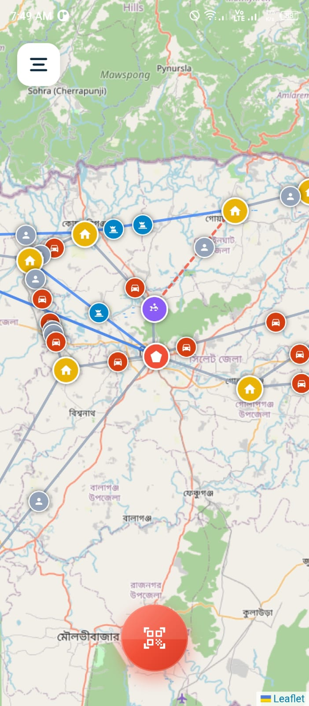
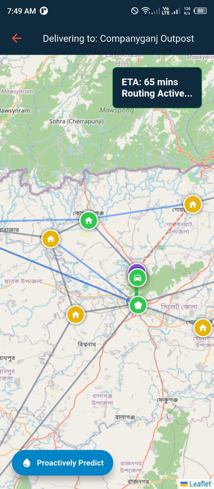
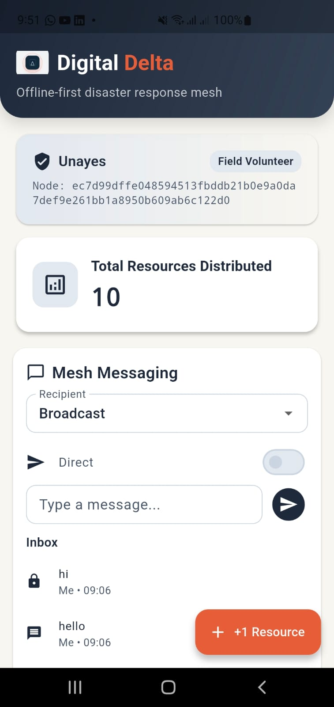
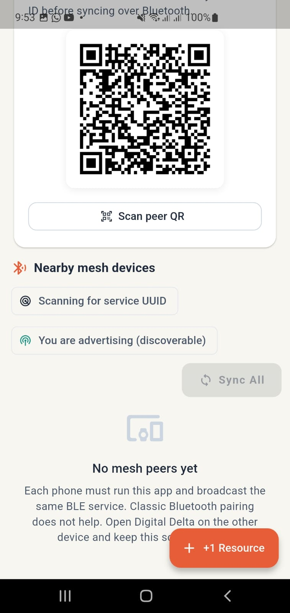

# Digital Delta

[](https://flutter.dev/)
[](https://pub.dev/packages/provider)
[](https://leafletjs.com/)
[](./delta/proto/digitaldelta.proto)

> Digital Delta is a disaster-response logistics mobile app designed for flood-prone regions. It helps responders visualize the relief network, identify blocked routes, optimize delivery paths, simulate AI-assisted flood prediction, manage inventory, and fall back to air-drop delivery when the ground network becomes unreachable.

## Quick Links

- [Project Overview](#project-overview)
- [Core Features](#core-features)
- [Technology Stack](#technology-stack)
- [Getting Started](#getting-started)
- [Architecture Diagram](./docs/architecture-diagram.md)
- [Demo Walkthrough](./DEMO.md)
- [Proto Schema](./delta/proto/digitaldelta.proto)

## Project Overview

Digital Delta presents a mobile-first emergency logistics experience for coordinating relief distribution during flood scenarios. The app combines a live operational map, stateful route status updates, route optimization, predictive flood-risk detection, and inventory management in a polished Flutter interface.

This repository currently contains:

- A Flutter mobile prototype in `my_app/`
- Protocol schema definitions in `delta/proto/digitaldelta.proto`
- Judge walkthrough instructions in `DEMO.md`
- A dedicated architecture diagram in `docs/architecture-diagram.md`

## Core Features

**1. Operations Login**

- Login screen with Role-Based Access Control (RBAC).
- Entering credentials proceeds to the main system with role-specific sidebar layouts (Supply Manager, Camp Commander, Field Volunteer).

**2. Live Logistics Network Map**

- Interactive operational map powered by Leaflet inside a Flutter WebView.
- Relief camps, command centers, hospitals, supply-drop nodes, and volunteers shown on the network.
- Road and waterway links are visually differentiated.

**3. Manual Flood Reporting**

- Tap a route segment to mark or clear flood disruptions.
- Flooded edges instantly update the globally shared app state.
- Route availability changes propagate instantly across all routing workflows.

**4. Destination Selection and Route Planning**

- Simulated QR flow for selecting a destination node.
- Shortest path calculation from the central hub to the selected destination.
- ETA display for the active delivery route with vehicle-specific animations.

**5. Predictive Logistics Engine**

- On-device execution of a custom Logistic Regression pipeline from scratch.
- Simulates rainfall, rate-of-change, and elevation signals to forecast disasters.
- Flags high-risk edges and displays real-time model metrics such as Accuracy, Precision, Recall, and F1 Score.

**6. Resilient Re-Routing**

- Recalculates routes automatically after manual or AI-predicted flood events.
- Dynamically avoids flooded edges using network graph traversal.
- Falls back to autonomous Drone/Air-Drop delivery simulations when no ground or water route is accessible.

**7. Inventory Registry**

- Add, view, edit, and delete critical supply items.
- Tracks SKU, unit quantities, and categories.
- Essential for simulating hub-side logistics and dispatch operations.

**8. Intelligent Priority Scheduling & SLA Tracking**

- Dynamic queue of relief requests categorized by priority (P0 to P3) and SLA deadlines.
- Advanced sorting algorithm factoring in both Dijkstra travel time and SLA slack time to mathematically minimize SLA breaches.
- Automated fleet simulation dispatching cars, boats, and drones sequentially.
- Comprehensive post-simulation report detailing delivery ETAs, success rates, and SLA breach logs.

---

## Application Gallery

<table>
  <tr>
    <td align="center">
      <br>
      <b>1. RBAC</b>
    </td>
    <td align="center">
      <br>
      <b>2. Live Operations Dashboard</b>
    </td>
    <td align="center">
      <br>
      <b>3. Role-Based Sidebar</b>
    </td>
  </tr>
  <tr>
    <td align="center">
      <br>
      <b>4. Destination Targeting</b>
    </td>
    <td align="center">
      <br>
      <b>5. Base Route Optimization</b>
    </td>
    <td align="center">
      <br>
      <b>6. Predictive ML Engine</b>
    </td>
  </tr>
  <tr>
    <td align="center">
      <br>
      <b>7. Air-Drop & Re-Routing</b>
    </td>
    <td align="center">
      <br>
      <b>8. SLA Priority Queue</b>
    </td>
    <td align="center">
      <br>
      <b>9. Live Fleet Simulation</b>
    </td>
  </tr>
  <tr>
    <td align="center">
      <br>
      <b>10. SLA Execution Report</b>
    </td>
    <td align="center">
      <br>
      <b>11. Profile (Part 1)</b>
    </td>
    <td align="center">
      <br>
      <b>12. Profile (Part 2)</b>
    </td>
  </tr>
</table>

## Technology Stack

### Mobile App

- Flutter
- Dart
- Provider
- webview_flutter

### Mapping and Visualization

- Leaflet
- OpenStreetMap tiles
- Embedded HTML/CSS/JavaScript inside WebView

### Data and Simulation

- In-memory mock logistics graph
- Seeded volunteer positions
- Simulated flood-risk prediction with logistic regression

### Protocol Definition

- Protocol Buffers (`proto3`)

### Important Files

- `my_app/lib/main.dart` - App entry, routes, Provider setup
- `my_app/lib/data/mock_data.dart` - Demo graph, edges, volunteers, inventory seed data
- `my_app/lib/providers/data_provider.dart` - Shared global state for routes and inventory
- `my_app/lib/screens/dashboard_screen.dart` - Live logistics map
- `my_app/lib/screens/route_optimization_screen.dart` - Route calculation, flood toggling, air-drop fallback
- `my_app/lib/screens/predict.dart` - Predictive flood-risk demo and metrics
- `delta/proto/digitaldelta.proto` - Messaging and logistics schema definitions

## Getting Started

### Prerequisites

- Flutter SDK compatible with Dart `^3.11.4`
- Android Studio or VS Code with Flutter tooling
- Android emulator or physical Android device recommended
- Internet connection required for loading OpenStreetMap tiles in the WebView

### Run The Mobile App

```bash
cd my_app
flutter pub get
flutter run
```

### Build APK

```bash
cd my_app
flutter build apk
```

## Architecture Snapshot

Digital Delta uses a Flutter frontend with a shared Provider-based state layer. Interactive maps are rendered through WebView-hosted Leaflet, while route disruptions and inventory changes are kept in the app-wide state. The predictive screen simulates flood-risk detection and writes route failures back into that same state so rerouting reflects both manual and AI-assisted disruptions.

For the full diagram, see [`docs/architecture-diagram.md`](./docs/architecture-diagram.md).

## Protocol Schema

The repository includes a protobuf schema at [`delta/proto/digitaldelta.proto`](./delta/proto/digitaldelta.proto). It defines structures for:

- Triage requests
- Inventory stock updates
- Road status events
- Delivery tasks and chain-of-custody data
- Chat messaging
- Sync envelopes and node identity
