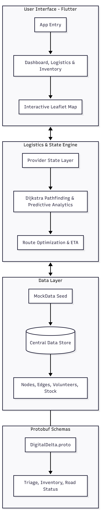

# Digital Delta Architecture Diagram

This diagram summarizes the current hackathon prototype structure and the supporting protocol layer included in the repository.

## Simple Architecture Diagram

## Complex Architecture Diagram

## Component Summary

- `Flutter UI`: screen flow, animations, mobile interaction
- `Provider State Layer`: shared in-memory state for routes, inventory, and disruptions
- `Leaflet WebView`: interactive map rendering and edge-level event handling
- `Prediction Engine`: simulated logistic regression for flood-risk detection
- `Routing Logic`: shortest path selection with flooded-edge avoidance and air-drop fallback
- `Proto Schema`: structured logistics and synchronization contracts included for the broader system design

## Notes

- The current mobile prototype is self-contained and demo-friendly
- Route and inventory state reset on app restart because the prototype uses seeded mock data
- The `.proto` layer is included in the repository to demonstrate system extensibility beyond the local UI prototype
